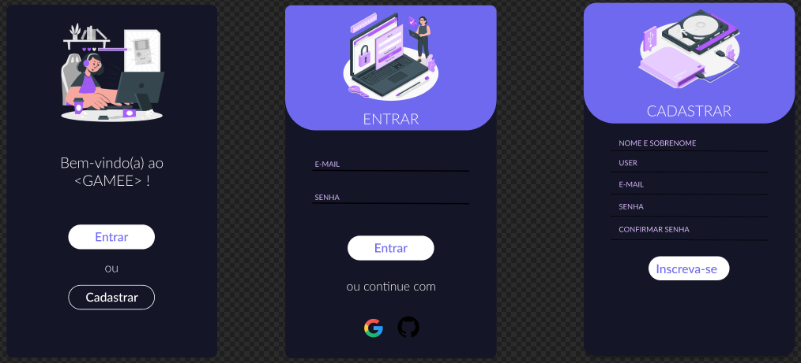
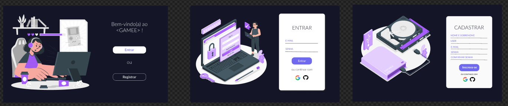

# Social Network - GAMEE
>SAP010 Laboratória

Desenvolvido por:
   
   
  Helouise Itokazo - [Linkedin](https://www.linkedin.com/in/helou%C3%ADse-itokazo-749778132/) | [Github](https://github.com/HelouiseItokazo)
   
  Larissa de Paula - [Linkedin]() | [Github](https://github.com/laridepaula)
   
  Nicole Monalisa Tsingas - [Linkedin](https://www.linkedin.com/in/nicole-tsingas-2079b218b/) | [Github](https://github.com/nicoletsingas)
   
   

## Índice

* [1. Prefácio](#1-prefácio)
* [2. Resumo do projeto](#2-resumo-do-projeto)
* [3. Histórias de usuário](#3-histórias-de-usuario)
* [4. Objetivos de aprendizagem](#4-objetivos-de-aprendizagem)
* [5. Tecnologias Utilizadas](#5-tecnologias-utilizadas)

 

## 1. Prefácio🤩
A rede social &lt;GAMEE&gt; é voltada para gamers que queiram compartilhar entre si atualizações de jogos, links de foruns/blogs tematicos dos games, servidores do discord e fazer muitos amigos para jogarem juntos!

## 2. Resumo do projeto📝
Terceiro projeto desenvolvido para o bootcamp da Laboratória. Neste projeto foi desenvolvido uma rede social onde o usuario consegue criar uma conta a partir de um formulário ou logar com um provedor (google ou github). Fazer um post de texto, curtir outros posts e editar seu perfil.

## 3. Histórias de usuário📝

<strong>História de usuário 1:</strong> Eu como uma usuária, gostaria de uma rede social onde consigo criar minha conta, inserindo um username(nickname) personalizado, email e senha. Uma rede social onde tenha uma página de bem-vindo.

<strong>História de usuário 2:</strong> Eu como usuário que já possuo conta cadastrada no gmail e github, gostaria de logar com esta conta no gamee.

<strong>História de usuário 3:</strong> Eu como usuário gostaria de publicar mensagens e atualizações de status para compartilhar com meus amigos gamers

<strong>História de usuário 4:</strong> Eu como usuário desejo poder editar e deletar minhas postagens. Assim como editar o meu perfil.

 

### Desenho de interface do usuário

#### Protótipo de alta fidelidade Mobile

#### Protótipo de alta fidelidade Desktop

## 4. Objetivos de aprendizagem✅

<ul>
  <li>Uso de HTML semântico</li> 
  <li>Uso de seletores de CSS</li> 
  <li>Modelo de caixa (box model): borda, margem, preenchimento</li>  
  <li>Uso de flexbox e grid em CSS</li> 
  <li>Uso de seletores de DOM</li> 
  <li>Manipulação de eventos de DOM (listeners, propagação, delegação)</li> 
  <li>Arrays (arranjos)</li> 
  <li>Objetos (key, value)</li> 
  <li>Variáveis (declaração, atribuição, escopo)</li> 
  <li>Promessas</li> 
  <li>Diferenciar entre tipos de dados primitivos e não primitivos</li> 
  <li>Uso de condicionais (if-else, switch, operador ternário, lógica booleana)</li> 
  <li>Funções (params, args, return)</li>
  <li>Single Page Application (SPA)</li>  
  <li>Testes unitários (unit tests)</li>
  <li>Testes assíncronos</li>
  <li>Uso de mocks e espiões</li> 
  <li>Firebase Auth</li> 
  <li>Firestore</li> 
</ul>

## 5. Tecnologias Utilizadas✅ 
      